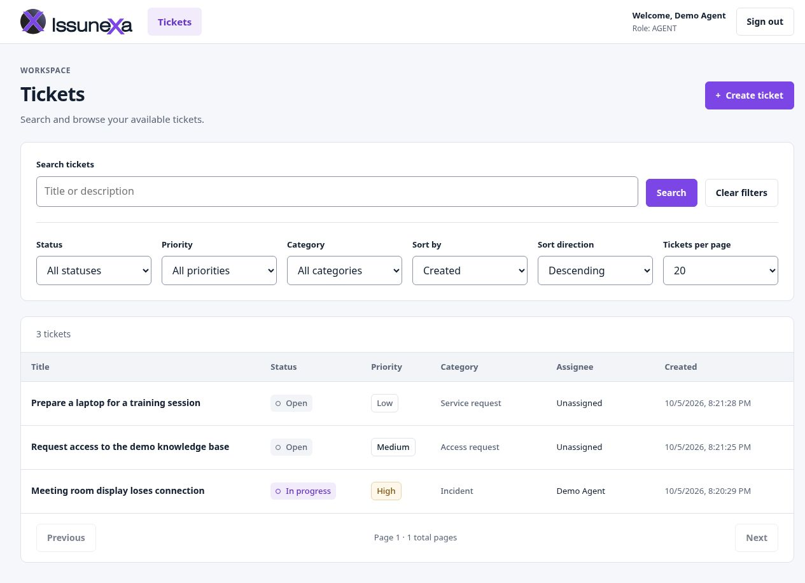
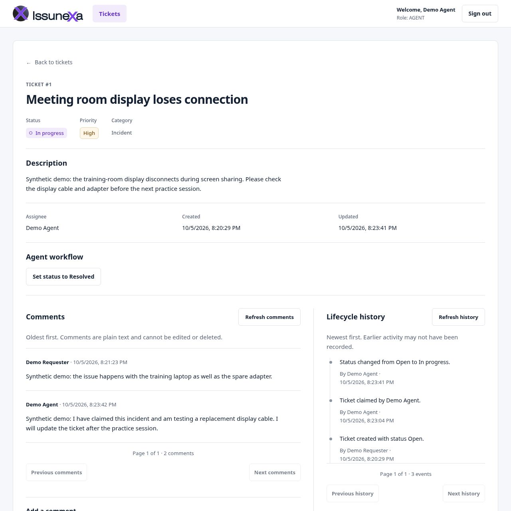
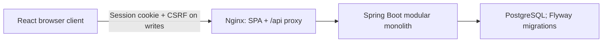

# Issunexa

Issunexa is a single-maintainer portfolio help-desk application: requesters submit and track support tickets, while agents claim work, move tickets through a defined lifecycle and discuss progress with requesters.

The repository contains a working React interface, a Spring Boot REST API and PostgreSQL persistence. It demonstrates ownership-aware queries, transactional workflow history, session authentication and tests against the real application stack. It is a local development project; no production deployment or adoption is claimed.

[Run locally](#run-locally) · [Architecture](docs/architecture.md) · [API guide](docs/api.md) · [Security](docs/security.md) · [Testing](docs/testing.md) · [Contributing](CONTRIBUTING.md)

## What works today

- **Requester workspace:** create tickets with priority and category; search, filter, sort and paginate owned tickets; open details and add comments.
- **Staff workflow:** AGENT and ADMIN can see all tickets, claim an unassigned ticket for themselves and change its status. The lifecycle is `OPEN → IN_PROGRESS → RESOLVED → CLOSED`, with reopening from `RESOLVED` to `IN_PROGRESS`.
- **Conversation and history:** paginated, append-only comments and structured creation/claim/status events. Ticket changes and their history entries commit together; competing updates return `409` for explicit refresh and retry.
- **Browser navigation:** login/logout, session restoration after reload, protected routes, URL-based list queries and return navigation. The branded layout adapts to narrow screens.

Authorization, filtering, ordering, pagination and totals are owned by the backend. ADMIN currently has the same ticket workflow capabilities as AGENT; it does not have a user-administration interface.

## Product views

Actual application captures with the supplied Issunexa branding and synthetic demo accounts/tickets. These are local UI examples, not production activity. [Full gallery and capture context](docs/screenshots/README.md).





## Technology and purpose

| Technology | Role in this implementation |
| --- | --- |
| Java 21 / Spring Boot 4.1.1 | One backend application; Spring MVC REST endpoints, validation and transactional services |
| Spring Security | Database-backed password authentication, server-side sessions, CSRF and role checks |
| Spring Data JPA / Hibernate | Entity mapping, queries and optimistic locking; schema validation with Open EntityManager in View disabled |
| PostgreSQL 18.6 / Flyway | Relational constraints and persistent data; versioned SQL migrations and explicit runtime grants |
| React / TypeScript / React Router | Ticket UI, runtime-validated API responses, protected routes and URL query state |
| Vite / Nginx | Development server and build; compiled SPA serving and same-origin `/api` proxy in Docker |
| Maven Wrapper / npm lockfile | Backend build and reproducible frontend dependency installation; CI uses Node 24.21.0 |
| springdoc-openapi | Generated OpenAPI contract and Swagger UI for the running backend |
| JUnit / Testcontainers / Vitest / Playwright | Backend, frontend and real-stack browser verification, described below |

## Architecture

Issunexa is a **modular monolith**: `auth`, `user`, `ticket`, comment/history and shared infrastructure packages run in one Spring application and share one database/transaction manager. These are package boundaries; module isolation is not enforced and business services are not independently deployed.



Controllers validate input and map explicit DTOs; services enforce ownership and workflow rules; repositories persist data. In Vite development, its proxy replaces Nginx for API traffic. See the [architecture overview](docs/architecture.md), [backend](docs/backend.md), [frontend](docs/frontend.md), [database](docs/database.md) and [accepted decisions](docs/decisions/001-modular-monolith.md).

## Authentication and security

- **Server-side sessions:** email/password login uses a delegating BCrypt password encoder. Login changes the session ID; logout invalidates it. The frontend keeps account/CSRF state in memory and restores it from the backend.
- **CSRF protection:** fetch session-bound metadata before login and send the returned header on writes, including logout. Fetch a fresh token after login; login itself is CSRF-protected.
- **Authorization and ownership:** requesters only see their own tickets, comments and history; hidden and missing tickets share a `404` response. Staff-only claims/status changes check roles in the service, including the current persisted role. Client route guards are presentation controls.
- **Login throttling:** bounded account-failure and source-request windows return generic `429` responses with `Retry-After`. State is process-local. The Compose proxy explicitly controls the source header; arbitrary forwarded headers are not trusted.
- **Database privilege separation:** bootstrap administration, Flyway schema ownership and JPA runtime access use distinct roles. Runtime cannot perform schema administration, delete/truncate data or access Flyway history. Migration credentials remain available to the backend process at startup.

The default Compose stack uses local HTTP and loopback host bindings. Sessions and throttling have no shared multi-instance store. See [security contracts, proxy assumptions and limitations](docs/security.md) and [database provisioning](docs/database.md#database-roles-and-provisioning).

## Run locally

Requires Git, Docker with Compose/Buildx and internet access for the initial images/dependencies. The full Docker build needs no host Java, Node, Maven or PostgreSQL.

Copy the HTTPS clone URL from this repository's **Code** menu. Replace the placeholder below with that URL and run this one-line assignment:

```sh
ISSUNEXA_REPOSITORY_URL='PASTE_HTTPS_CLONE_URL_HERE'
```

Then paste this block as a whole in the same terminal. It creates a local directory named `Issunexa`, independent of the repository's name:

```sh
git clone "$ISSUNEXA_REPOSITORY_URL" Issunexa
cd Issunexa
cp .env.example .env
```

Edit `.env`: choose three distinct, nonempty local database passwords. Then start the stack:

```sh
docker compose config --quiet
docker compose up --build -d
docker compose ps
docker compose logs backend
# After backend startup, verify the API through the frontend:
curl --fail http://localhost:3000/api/auth/csrf
```

Open [the UI](http://localhost:3000), [Swagger UI](http://localhost:8080/swagger-ui.html) or [OpenAPI JSON](http://localhost:8080/v3/api-docs). The frontend's static health check alone does not prove API readiness; an early request can return `502` while the backend starts.

**A fresh database has no accounts.** There is no public registration API. To sign in, follow [local demo-account provisioning](docs/local-development.md#local-demo-accounts), which uses Java 21 and the existing internal account service. Keep `.env` private; do not overwrite it on an existing installation. `docker compose down` preserves database data.

For hot-reload development, use Node 24.21.0 and keep the backend on port 8080:

```sh
# Repository root, after .env setup:
docker compose up --build -d postgres backend
# In another terminal, from the repository root:
cd frontend
npm ci
npm run dev
```

Vite normally serves `http://localhost:5173` and proxies `/api` to the backend. [The setup guide](docs/local-development.md) covers readiness, port changes, host-run Java, account provisioning and cleanup; [database docs](docs/database.md) cover existing-volume upgrades.

## Testing and CI

| Layer | Actual coverage | Run locally |
| --- | --- | --- |
| Backend | Entity/service unit tests, MVC binding/validation tests and PostgreSQL integration tests: authentication/CSRF, ownership, workflow/concurrency, comments/history, migrations, privileges and OpenAPI | In `backend/`: `./mvnw --batch-mode --no-transfer-progress verify` (Java 21 + Docker) |
| Frontend | Vitest/Testing Library tests for sessions, decoded responses, URL queries, forms, workflow and failure recovery; lint, E2E type checks and production build | In `frontend/`: `npm ci`, `npm run lint`, `npm run typecheck:e2e`, `npm test`, `npm run build` (Node 24.21.0) |
| Full stack | Playwright journeys through real Nginx, Spring Boot and PostgreSQL: login/reload/logout, requester isolation, ticket activity, staff workflow, query navigation, mobile usability and login throttling | In `frontend/`, after `npm ci`: `npm run test:e2e` (Node 24 + Docker/Compose/Buildx) |

Three independent GitHub Actions workflows—[Backend CI](.github/workflows/backend-ci.yml), [Frontend CI](.github/workflows/frontend-ci.yml) and [E2E CI](.github/workflows/e2e-ci.yml)—run on pushes to `master`, pull requests targeting `master` and manual dispatch. They run the checks above; E2E failures retain available reports/traces/screenshots for seven days. Docker image builds skip tests and do not replace CI verification.

E2E uses generated credentials, synthetic accounts and an isolated Compose database, then cleans up its own resources. Browser coverage is desktop Chromium plus Pixel 7 Chromium emulation; it does not establish Safari/physical-device coverage. [Testing details and diagnostics](docs/testing.md).

## Repository navigation and current limits

| Path | Contents |
| --- | --- |
| [backend/](backend/) | REST API, domain/services, migrations, provisioning, tests and Maven Wrapper |
| [frontend/](frontend/) | React client, official branding, Vitest/Playwright tests and Nginx configuration |
| [docs/](docs/) | Architecture, security, database, API, setup, testing and decision records |
| [compose.yaml](compose.yaml) / [compose.e2e.yaml](compose.e2e.yaml) | Local stack and disposable browser-test overlay |
| [.github/](.github/) | CI workflows and issue/PR templates |

Current scope excludes public registration/password recovery, user administration, attachments, notifications and offline behavior. Comments/history have no edit/delete endpoints; history before migration V8 is not backfilled. Public deployment, TLS, operational backups and multi-instance session/throttle storage need separate work. Use this repository's **Issues** tab for planned work; no delivery dates are promised.

See [CONTRIBUTING.md](CONTRIBUTING.md) for the Issue → branch → PR → CI → review → merge workflow.
