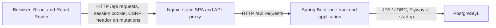

# Architecture

Issunexa is a portfolio help-desk application with a React browser client, a Spring Boot modular monolith and PostgreSQL. This overview describes the current implementation. Local setup and detailed API examples remain in the [README](../README.md); the contribution process is in [CONTRIBUTING.md](../CONTRIBUTING.md).

## Runtime and request flow

In the [Compose environment](../compose.yaml), Nginx serves the compiled frontend and forwards `/api/...` to `backend:8080`. Spring MVC controllers delegate to transactional services, which use JPA repositories and PostgreSQL. Responses return through Nginx to the browser. The browser uses one origin for static files and API traffic.

The default frontend address is `http://localhost:3000`; backend and database host bindings are loopback-only. In the separate Vite development workflow, the [development proxy](../frontend/vite.config.ts) forwards `/api` to the backend on port 8080. The backend architecture is the same in both workflows.

## Component boundaries

| Boundary | Responsibility | Detail |
| --- | --- | --- |
| React client | Routes, session bootstrap, forms, decoded API data and URL-driven Ticket controls | [Frontend](frontend.md) |
| Nginx | Compiled assets, SPA route fallback and relative API proxying | [Configuration](../frontend/nginx.conf) |
| Spring Boot backend | Authentication, authorization, validation, Ticket rules and transaction coordination | [Backend](backend.md), [security](security.md) |
| PostgreSQL / Flyway | Durable application data, constraints and versioned schema evolution | [Database](database.md) |

The backend has one [application entry point](../backend/src/main/java/io/github/panteliszara/issunexa/IssunexaApplication.java) and one [Maven build](../backend/pom.xml). Its `auth`, `user`, `ticket`, `ticket.comment`, `ticket.history` and `shared` packages share a Spring application context and database. These are package-level boundaries, not separately deployed business services or enforced module isolation. The Nginx, backend and database containers separate runtime responsibilities; business logic remains in one backend application.

## Build and verification boundaries

The [backend Dockerfile](../backend/Dockerfile) packages a Java 21 runtime and skips tests during image construction. The [frontend Dockerfile](../frontend/Dockerfile) builds with Node 24.21.0 and copies only compiled assets into Nginx. Both application containers run as non-root users.

Three independent workflows run on pushes/PRs targeting `master` and manual dispatch:

- [Backend CI](../.github/workflows/backend-ci.yml): Maven `verify`, including PostgreSQL integration tests with Testcontainers.
- [Frontend CI](../.github/workflows/frontend-ci.yml): lint, E2E TypeScript checks, Vitest and production build.
- [E2E CI](../.github/workflows/e2e-ci.yml): the same `npm run test:e2e` command used locally from `frontend/`.

The [E2E runner](../frontend/e2e/run-e2e.sh) builds real application images, creates an isolated database, checks readiness through Nginx and `/api/auth/csrf`, and provisions synthetic accounts only in that database. It removes its invocation's containers, network, volume, temporary credentials and image tags. [Playwright](../frontend/playwright.config.ts) covers desktop Chromium and Pixel 7 Chromium emulation; mobile emulation does not establish physical-device or Safari coverage.

## Accepted decisions and limits

- [ADR 001: modular monolith](decisions/001-modular-monolith.md)
- [ADR 002: sessions and CSRF](decisions/002-session-authentication.md)
- [ADR 003: PostgreSQL and Flyway](decisions/003-postgresql-flyway.md)

These ADRs record decisions already embodied in the implementation. Compose defines a local HTTP environment. No production deployment, capacity measurement or independent business-service scaling is established by this repository.
