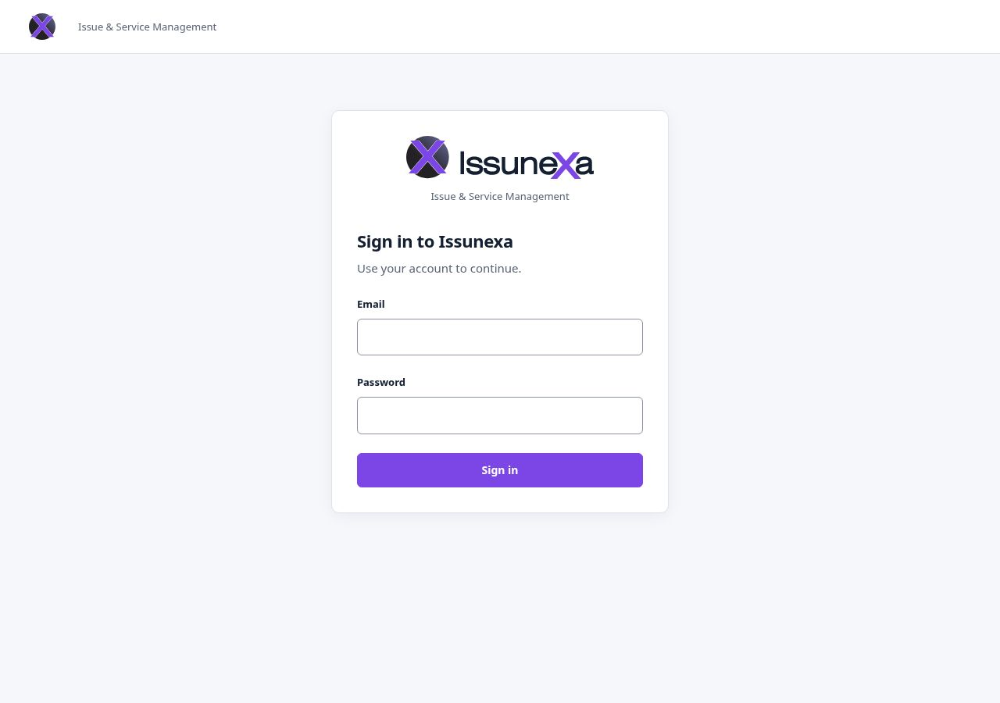

# Product screenshots

These captures show the application built from the implementation at `8ccc563`, the `master` baseline used for these captures. Documentation changes do not alter the UI. Images were captured on 2026-10-05 from the compiled React application served by Nginx, connected to the real Spring Boot backend and a fresh PostgreSQL database.

The supplied Issunexa SVG wordmark and purple X identity are rendered by the application itself; see the [branding inventory](../../frontend/branding/README.md). These are page captures at a desktop breakpoint (1280-pixel viewport width), without browser chrome or development overlays. The detail capture is clipped to the workflow/conversation/history area; no page content was edited.

Only synthetic data appears: `Demo Requester`, `Demo Agent` and three training/demo tickets. The accounts were explicitly provisioned through the existing internal account service in a disposable local database. Tickets, comments, the claim and the status change were created through the actual UI; the detail was reloaded to confirm persisted state. No password, cookie, token, private host, customer data or deployment claim is shown. Dates are local capture times, not evidence of production activity.

## Ticket workspace

The staff view shows server-returned tickets, priority/category, assignment and search/filter/sort/pagination controls. The incident is assigned and in progress; the other examples remain open and unassigned.

## Ticket detail and staff workflow

The incident shows a real self-claim and `OPEN → IN_PROGRESS` transition, requester/agent comments and structured lifecycle history. The remaining staff action is resolution.

## Sign in

The empty sign-in form uses the official wordmark. No credentials are entered in this capture.

To explore these views locally, follow [setup and explicit demo-account provisioning](../local-development.md). A normal fresh database has no seeded users or tickets. These images illustrate currently implemented behavior, not a hosted demo or adoption metrics.
